## 初识Arduino

### 简介

Arduino并不仅仅是一块小小的电路板，而是一个开放的电子开发平台。它包含了硬件——电路板、软件——开发环境，还有许许多多开发者、使用者创造的代码、程序、电路、项目。

### 热度

Arduino自2005年推出以来，广受好评，如今已成为最热门的开源硬件之一。在全球最大的开源社区Github上，Arduino已经成为了一个语言分类；而IEEE发布的2017年编程语言流行程度排行榜上，Arduino成为了仅次于C/C++的嵌入式编程语言；近年来，国内各大高校，甚至中小学都开始使用Arduino开展教学工作。Arduino的热门程度可见一斑。

### Arduino开发语言

Arduino编译器使用的是GCC，这是GNU开源计划的核心，使用最为广泛的编译器之一；Arduino语言衍生自Wiring语言，这是一个开源的单片机编程架构，同时Arduino语言又是基于AVR libc这个AVR单片机扩展库编写的，AVR libc也是一个优秀的开源项目；Arduino集成开发环境是基于Processing集成开发环境的，Processing是一个为设计师设计新型语言，当然这也是一个开源项目。Processing集成开发环境是由Java编写的，Java是众多周知的开源项目；

### Arduino 开发板分类

#### Arduino UNO

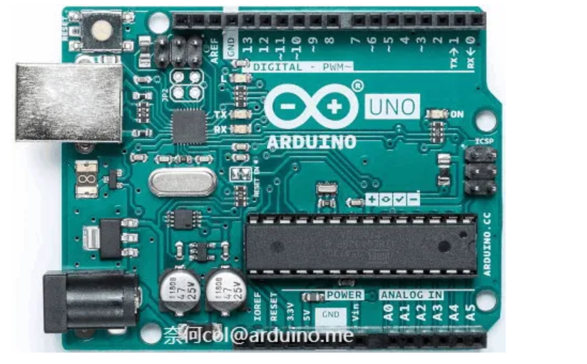

Arduino UNO是目前使用最广泛的Arduino控制器，具有Arduino的所有基础功能，是初学者的最佳选择。

“Uno”在意大利语中意思是“一”。Arduino UNO是Arduino系列的一号开发板，Arduino IDE 1.0是Arduino软件的第一个正式版本，Arduino UNO硬件和Arduino IDE软件建立了一套Arduino开发标准，此后的Arduino开发板和衍生产品都是在这个标准上建立起来的。

在掌握了UNO的开发技巧后，就可以将代码轻松的移植到其他型号的Arduino控制器上。

#### Arduino MEGA

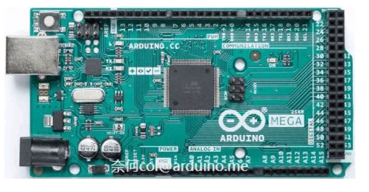


Arduino MEGA 是一个增强型的Arduino控制器，相对于UNO，它提供了更多输入输出接口，可以控制更多的设备，以及拥有更大的程序空间和内存。是完成较大型项目的好选择。

#### Arduino Leonardo

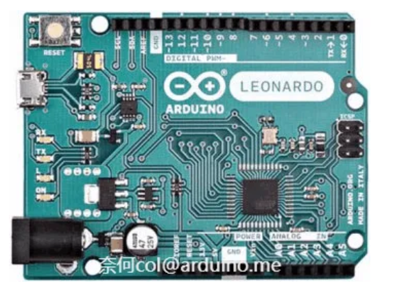


Arduino Leonardo 是增强性Arduino控制器，它使用集成USB功能的AVR单片机做主控芯片，不仅具备其他型号Arduino UNO控制器的所有功能，还可以模拟鼠标键盘等USB设备。

#### Arduino Due

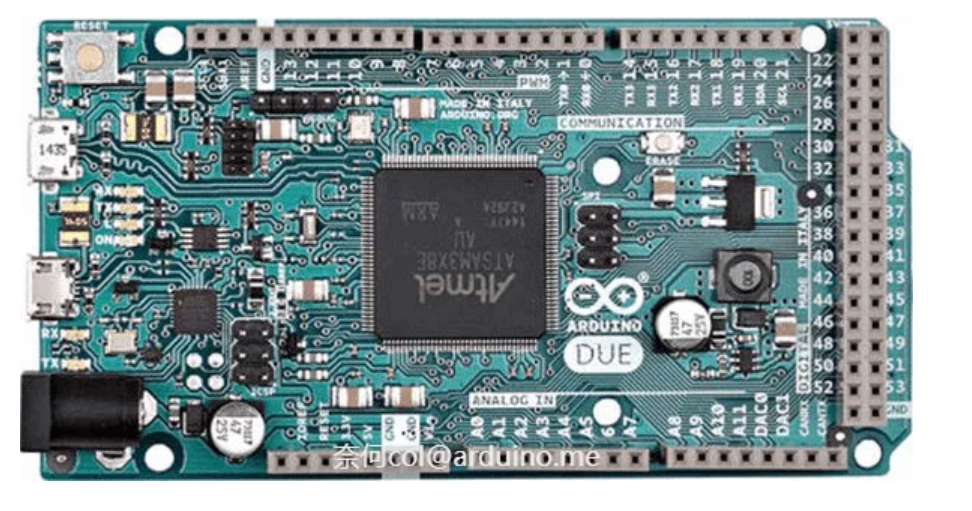


Arduino Due 与以往使用8位AVR单片机的Arduino控制器不同，Due突破性的使用了32位的ARM Cortex-M3作为主控芯片。它集成了多种外设，性能优于AVR核心的arduino，能以进行更多复杂的计算。

#### Arduino Zero

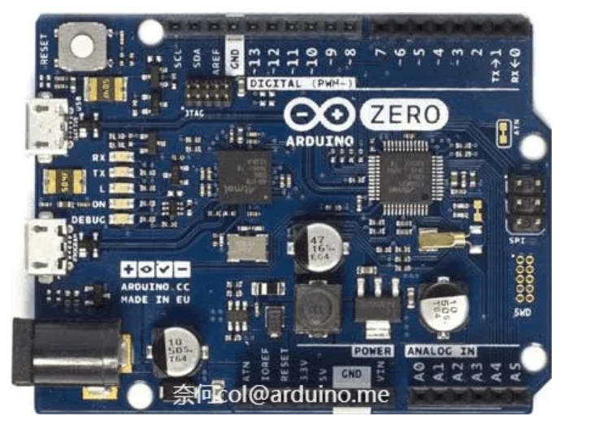


Arduino Zero 是使用 32位ARM Cortex-M0作为主控芯片的Arduino控制器，功能基本与Arduino Leonardo相同。其最大的特点是带有Atmel 调试器（DEBUG），使得开发人员可以调试程序。

#### 小型化Arduino

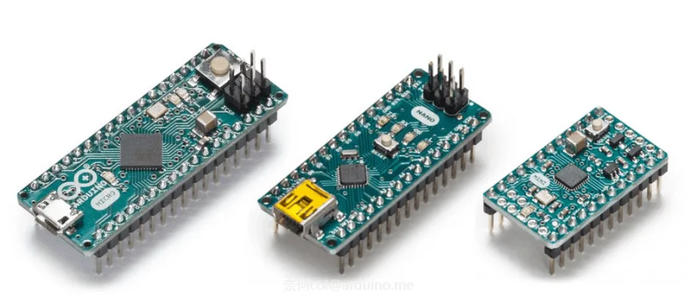


为应对特殊场合要求，Arduino还有许多小型化的设计方案。常见的小型Arduino控制器有Arduino Nano、Arduino Micro、Arduino mini、Arduino Lilypad等。设计上它们精简了许多地方，但使用上一样方便。其中Arduino Mini和Arduino Lilypad需要外部模块配合完成程序下载功能。

Arduino公布了原理图及PCB图纸，并使用了开源协议，使得其他硬件厂商也可以生产Arduino控制器，但"Arduino"商标归Arduino团队所有，其他生产商不能使用。

众多Arduino爱好者及硬件公司将Arduino核心库移植到了其他单片机上。这类衍生控制器有着与Arduino兼容的硬件外形设计，一样简单的开发环境，和更加强大的功能外设。只要掌握了Arduino的开发方式，即可轻松的使用这些衍生控制器来完成开发工作。

#### Maple

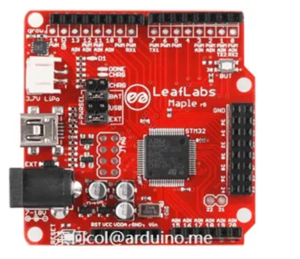

Maple是LeafLabs公司基于意法半导体的STM32芯片开发的、以ARM Cortex-M3核心的衍生控制器。Arduino_Core_STM32项目使得部分STM32芯片可以使用Arduino SDK进行开发。

Arduino_Core_STM32项目地址：https://github.com/stm32duino

#### ChipKit

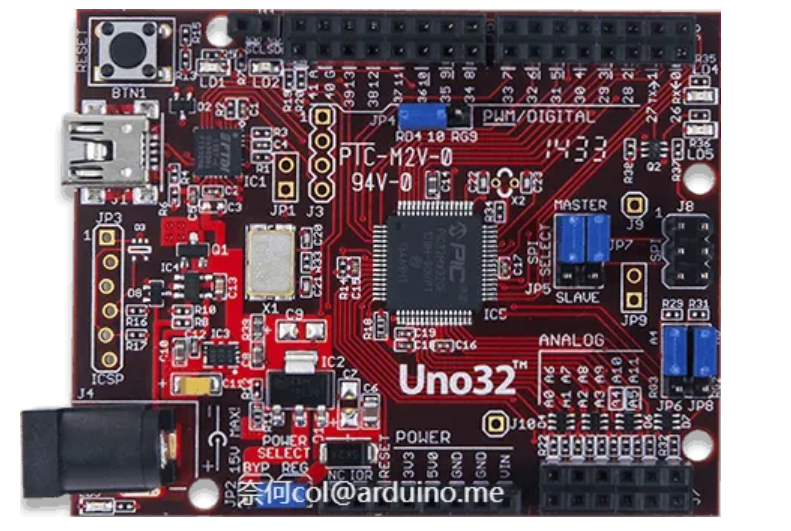


ChipKit是DIGILENT公司推出的基于微芯公司PIC32芯片开发的MIPS核心的Arduino衍生控制器。

ChipKit项目地址：https://github.com/chipKIT32

#### WiFiduino

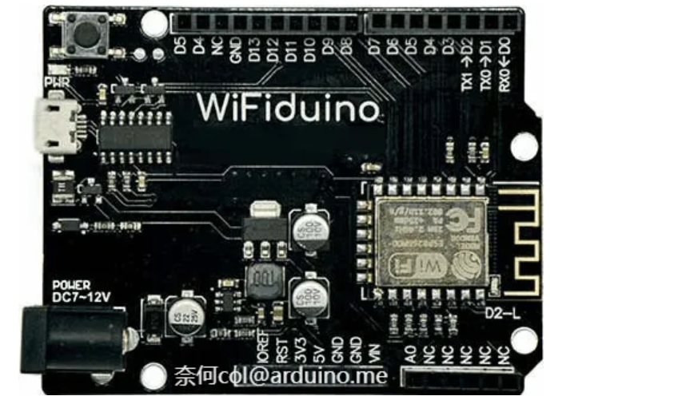

WiFiduino是使用esp8266、esp32作为核心的开发板，相对于传统Arduino控制器，WiFiduino提供了WiFi支持，可以更轻松地构建基于WiFi的物联网项目。

esp8266 Arduino项目地址：https://github.com/esp8266/Arduino

esp32 Arduino项目地址：https://github.com/espressif/arduino-esp32


## Arduino Uno

Arduino UNO是入门Arduino的最佳选择。本笔记以 Arduino Uno R3。

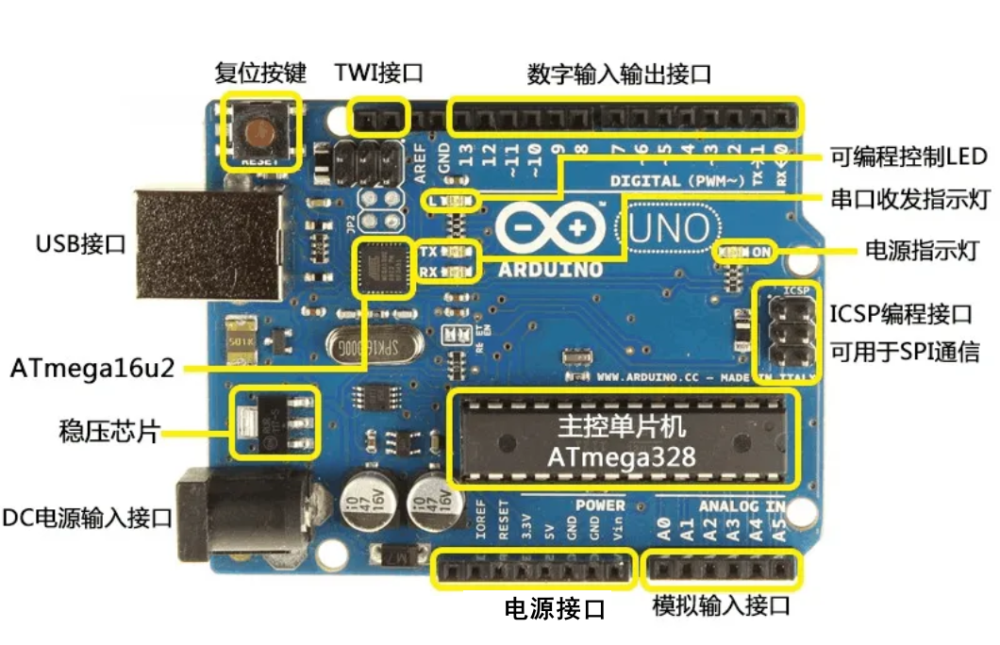

### 电源（Power）：

> Arduino UNO有三种供电方式：
>
> 1．通过USB接口供电，电压为5V；
>
> 2．通过DC电源输入接口供电，电压要求7～12V；
>
> 3．通过电源接口处5V或者VIN端口供电，5V端口处供电必须为5V，VIN端口处供电为7~12V；

### 指示灯（LED）：

> Arduino UNO带有4个LED指示灯，作用分别如下：
>
> ON：电源指示灯。当Arduino通电时，ON灯会点亮；
>
> TX：串口发送指示灯。当使用USB连接到计算机且Arduino向计算机传输数据时，TX灯会点亮。
>
> RX：串口接收指示灯。当使用USB连接到计算机且Arduino接收到计算机传来的数据时，RX灯会点亮。
>
> L：可编程控制指示灯。该LED通过特殊电路连接到Arduino的13号引脚，当13号引脚为高电平或高阻态时，该LED 会点亮；低电平时，不会点亮。因此可以通过程序或者外部输入信号，控制该LED亮灭。

### 复位按键（Reset Button）：

> 按下该按键，可以让Arduino重新启动，从头开始运行程序。

### 存储空间（Memory）：

> Arduino的存储空间即是其主控芯片所集成的存储空间。也可以通过使用外设芯片的方式，扩展Arduino的存储空间。
>
> Flash：32KB
>
> 其中0.5KB分作BOOT区用于储存引导程序，实现串口下载程序的功能，另外的31.5KB是用户可以储存程序的空间。相对于现在动辄几百G的硬盘，可能觉得32KB很小很小，但在单片机上，32KB已经可以存储很大的程序了。
>
> SRAM：2KB
>
> SRAM相当于计算机的内存，在CPU进行运算时，需要在其中开辟一定的存储空间。当Arduino断电或者复位后，其中的数据都会丢失。
>
> EEPROM：1KB
>
> EEPROM全称为电可擦写可编程只读存储器，是一种用户可更改的只读存储器，其特点是Arduino断电或者复位后，其中的数据不会丢失。

### 输入输出端口（I/O Port）：

> 如图所示，Arduino UNO有14个数字输入输出端口，6个模拟输入端口。其中一些带有特殊功能，这些端口如下：
>
> UART通信：0（RX）、1（TX）
>
> 被用于接收和发送串口数据。这两个引脚通过连接到ATmega16u2来与计算机进行串口通信。
>
> 外部中断：2、3
>
> 可以输入外部中断信号。
>
> PWM输出：3、5、6、9、10、11 可用于输出PWM波。
>
> SPI通信：10（SS）、11（MOSI）、12（MISO）、13（SCK） 可用于SPI通信。
>
> TWI通信：A4（SDA）、A5（SCL）和TWI接口 可用于TWI通信，兼容I²C通信。
>
> AREF：模拟输入参考电压输入端口。
>
> Reset：复位端口。接低电平会使Arduino复位，复位按键按下时，会使该端口接到低电平，从而让Arduino复位。

## 开发

### Arduino语言

Arduino使用C/C++编写程序，虽然C++兼容C语言，但这是两种语言，C语言是一种面向过程的编程语言，C++是一种面向对象的编程语言。目前最新的Arduino核心库采用C与C++混合编写而成。

通常所说的Arduino语言其实是一套基于C/C++的嵌入式设备开发框架。其核心库文件提供了各种应用程序编程接口（Application Programming Interface，简称API）以供驱动硬件设备，这些API是对更底层的单片机支持库进行二次封装所形成的。例如，使用AVR单片机的Arduino的核心库是对AVR-Libc（基于GCC的AVR支持库）的二次封装。

传统开发方式中，需要厘清每个寄存器的意义及之间的关系，然后通过配置多个寄存器来达到目的。

而在Arduino中，使用了清楚明了的API替代繁杂的寄存器配置过程，如以下代码：

```cpp
pinMode(13,OUTPUT);
digitalWrite(13,HIGH);
```

pinMode(13,OUTPUT)即是设置引脚的模式，这里设定了13脚为输出模式；而digitalWrite(13,HIGH) 是让13脚输出高电平数字信号。

这些封装好的API，使得程序中的语句更容易被理解，不用理会单片机中繁杂的寄存器配置，就能直观地控制Arduino，增强程序的可读性的同时，也提高了开发效率。


### Arduino程序结构

如果使用过C/C++语言，你会发现Arduino的程序结构与传统的C/C++结构的不同------Arduino程序中没有main函数。

其实并不是Arduino没有main函数，而是main函数的定义隐藏在了Arduino的核心库文件中。Arduino开发一般不直接操作main()函数，而是使用Setup()和loop()这个两个函数。

通过 `Arduino IDE菜单>文件>示例>01.Basics>BareMinimum`可以看到Arduino程序的基本结构：

```c
void setup() {
  // 在这里加入setup代码，它只会运行一次：
}

void loop() {
  // 在这里加入loop代码,它会不断重复运行：
}
```

Arduino程序基本结构由setup() 和loop() 两个函数组成：

```c
void setup()
```

Arduino控制器通电或复位后，即会开始执行setup() 函数中的程序，该部分只会执行一次。

```c
void loop()
```

在setup() 函数中的程序执行完后，Arduino会接着执行loop() 函数中的程序。而loop()函数是一个死循环，其中的程序会不断的重复运行。

实际开发中，通常在setup() 函数中完成Arduino的初始化设置，如配置I/O口状态，初始化串口等操作；在loop() 函数中完成程序的主要功能，如驱动各种模块，采集数据等。


### 数字I/O的使用

Arduino Uno上每一个带有数字编号的引脚，都是数字引脚，包括写有"A"编号的模拟输入引脚，如图2-21。使用这些引脚具有输入输出数字信号的功能。

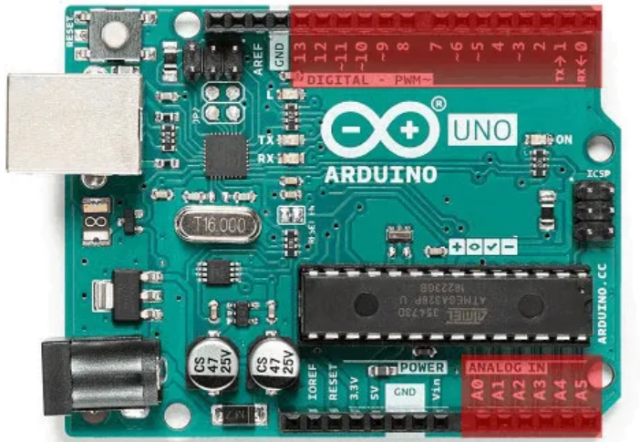

**数字信号**

数字信号是以0、1表示的电平不连续变化的信号，也就是以二进制的形式表示的信号。 在Arduino中数字信号通过高低电平来表示，高电平则为数字信号1，低电平则为数字信号0 。

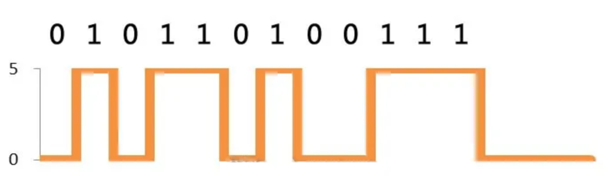

Arduino Uno上每一个带有数字编号的引脚，都是数字引脚，包括写有"A"编号的模拟输入引脚。使用这些引脚，可以完成输入输出数字信号的功能。

在使用输入或输出功能前，需要先通过pinMode() 函数配置引脚的模式为输入模式或输出模式。

```c
pinMode(pin, mode);
```

参数pin为指定配置的引脚编号；参数mode为指定的配置模式。

可使用的三种模式，如下表所示：

| 模式宏名称   | 说明         |
| ------------ | ------------ |
| INPUT        | 输入模式     |
| OUTPUT       | 输出模式     |
| INPUT_PULLUP | 输入上拉模式 |

如在Blink程序中使用到了pinMode(13, OUTPUT)，即是把13号引脚配置为输出模式。

配置成输出模式后，还需要使用digitalWrite() 让其输出高电平或者是低电平。其调用形式为：

```c
digitalWrite(pin, value);
```

参数pin为指定输出的引脚编号；参数value为要指定输出的电平，使用HIGH指定输出高电平，或是使用LOW指定输出低电平。

Arduino中输出的低电平为0V，输出的高电平为当前Arduino的工作电压。例如Arduino UNO的工作电压为5V，其高电平输出也是5V。

数字引脚除了用于输出信号外，还可以用digitalRead() 函数读取外部输入的数字信号，其调用形式为：

```c
int value = digitalRead(pin);
```

参数pin为指定读取状态的引脚编号；返回值value为获取到的信号状态，1为高电平，0为低电平。

Arduino Uno会将大于1.5V的输入电压视为高电平识别，小于1.3V的电压视为低电平识别。所以，即使输入电压不太准确，Arduino Uno也可以正常识别。需要注意的是，超过5V的输入电压可能会损坏Arduino Uno。

在Arduino核心库中，OUTPUT被定义等于1，INPUT被定义等于0，HIGH被定义等于1，LOW被定义等于0。因此这里也可以用数字替代这些宏定义。如：

```c
pinMode(13,1); 
digitalWrite(13,1); 
```

此处仅作说明，并不推荐这样编写代码，因为如此会降低程序的可读性。

回到最初的Blink程序，在`Arduino IDE菜单>文件>示例>01.Basics>Blink` 找到它。程序如下：

```c
/*
Blink
等待一秒钟，点亮LED，再等待一秒钟，熄灭LED，如此循环
*/ 

// 在大多数Arduino控制板上 13号引脚都连接了一个标有“L”的LED灯

// 在板子启动或者复位重启后， setup部分的程序只会运行一次
void setup(){                
// 将LED引脚设置为输出状态
  pinMode(LED_BUILTIN, OUTPUT);    
}

// setup部分程序运行完后，loop部分的程序会不断重复运行
void loop() {
  digitalWrite(LED_BUILTIN, HIGH);   // 点亮LED
  delay(1000);                       // 等待一秒钟
  digitalWrite(LED_BUILTIN, LOW);    // 通过将引脚电平拉低，关闭LED
  delay(1000);                       // 等待一秒钟
}
```

在以上程序中，使用了LED_BUILTIN，这是一个arduino核心库定义的宏：

```c
#define LED_BUILTIN 13
```

在大多数标准的Arduino开发板上都有一个可编程控制的LED，宏LED_BUILTIN对应的值则是该LED连接到的引脚编号。在Arduino UNO、MEGA等官方开发板上，这个LED通常是连接到 D13 引脚。

在实际开发中，可以使用宏定义的方式，来为引脚设置一个别名，如：

```c
#define LED 13 
```

这样就可以为D13脚连接的设备设置了一个别名"LED"，在此后的程序中，使用"LED"则可代表对应编号的引脚（或者是该引脚上连接的设备）。

也可以使用变量的方式为引脚设置一个别名，如：

```c
int led = 13;
```

这样就可以为D13脚连接的设备设置了一个别名"led"。

定义别名可以提高程序的可读性，并且方便修改，如设备需要更换连接引脚，直接修改该变量对应的数值即可。

程序中

```c
delay() 
```

为毫秒延时函数，delay(1000) 即延时1秒（1000毫秒），在本程序中用来控制开关LED的间隔时间。可以自行修改Blink例程中的delay参数，观察实际运行效果。

Blink是最简单的Arduino程序，在此基础上，还可以制作控制多个LED，逐个点亮，逐个熄灭的流水灯效果。


### 模拟I/O的使用

在Arduino控制器中，编号前带有"A"的引脚是模拟输入引脚。Arduino可以读取这些引脚上输入的模拟值，即读取引脚上输入的电压大小。

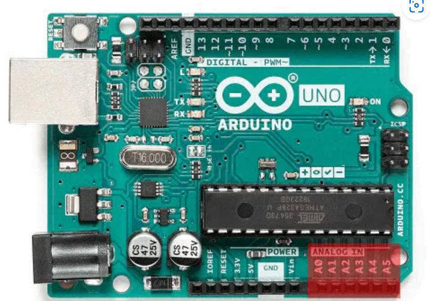

**模拟信号**

生活中，接触到的大多数信号都是模拟信号，如声音、温度的变化等。如下图所示，模拟信号是用连续变化的物理量表示的信息，信号随时间作连续变化。在Arduino Uno上，可以接受0～5V的模拟信号。


模拟输入引脚是带有ADC（Analog-to-Digital Converter，模数转换器）功能的引脚。它可以将外部输入的模拟信号转换为芯片运算时可以识别的数字信号，从而实现读入模拟值的功能。

Arduino Uno模拟输入功能有10位精度，即可以将0～5V的电压信号转换为0～1023的整数形式表示。

模拟输入功能需要使用analogRead() 函数。

```c++
int value = analogRead(pin)
```

参数pin是指定要读取模拟值的引脚，被指定的引脚必须是模拟输入引脚。如analogRead(A0)，即是读取A0引脚上的模拟值。

与模拟输入功能对应的是模拟输出功能，使用analogWrite() 函数实现这个功能。但该函数并不是输出真正意义上的模拟值，而是以一种特殊的方式来达到输出近似模拟值的效果，这种方式叫做脉冲宽度调制（PWM，Pulse Width Modulation）。

在Arduino Uno中，提供PWM功能的引脚为3、5、6、9、10、11。

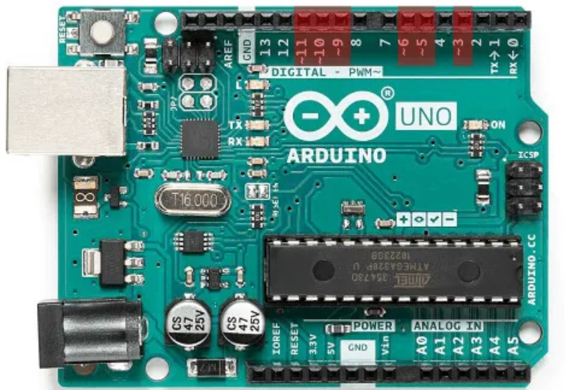

当使用analogWrite() 函数时，指定引脚会通过高低电平的不断转换输出一个周期固定的方波，通过改变高低电平在每个周期中所占的比例（占空比），而得到近似输出不同的电压的效果。

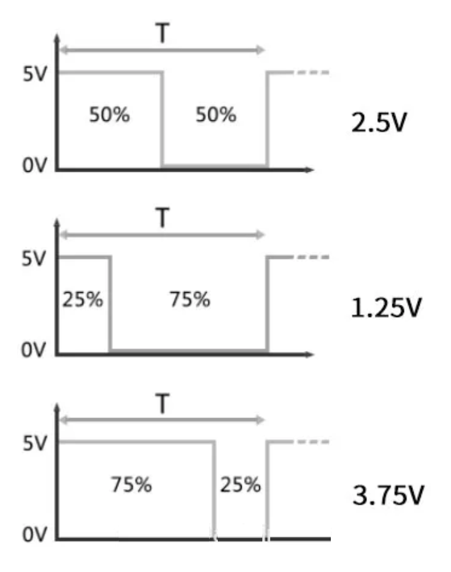

需要注意的是，这里仅仅是得到了近似模拟值输出的效果，如果要输出真正的模拟值，还需要加上外围滤波电路。

```c++
analogWrite(pin,value)
```

参数pin是指定要输出PWM波的引脚，参数value指定是PWM的脉冲宽度，范围为0～255。

在analogWrite() 和analogRead() 函数内部，已经完成了引脚的初始化，因此不用在Setup() 函数中进行初始化操作。

### 常用函数

## 开发案例

### Blink

### 舵机


#### 接线

舵机信号线连接到Arduino Uno R3 主板的 7 脚,烧录程序之后，在串口监视器中输入要调整舵机的角度，让舵机转到相应角度的位置

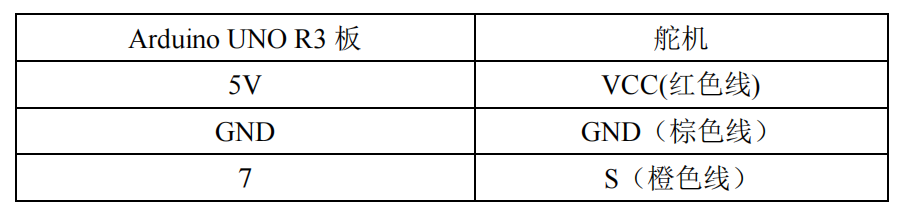

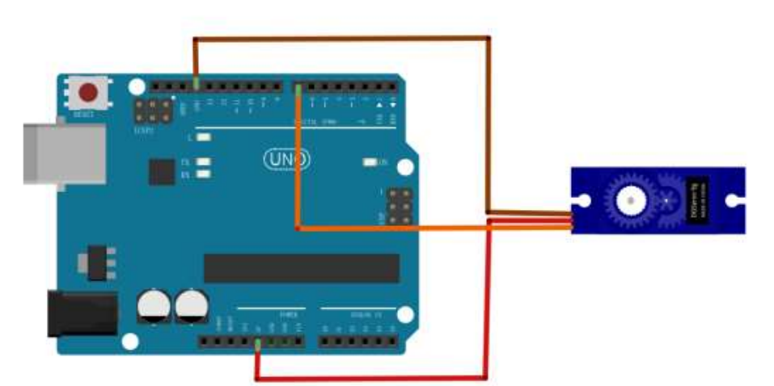

#### 程序

不使用伺服电机库函数

```c
int servopin = 7;
// 定义函数
void servopulse(int angle) {
  int pulsewidth = (angle * 11) + 500;
  digitalWrite(servopin, HIGH);
  delayMicroseconds(pulsewidth);
  digitalWrite(servopin, LOW);
  delayMicroseconds(20000 - pulsewidth);
}
void setup() {
  pinMode(servopin, OUTPUT);
}
void loop() {
  for (int angle = 0; angle < 180; angle += 2) {
    for (int i = 0; i < 10; i++) {
      servopulse(angle);
    }
  }
  for (int angle = 180; angle > 0; angle -= 2) {
    for (int i = 0; i < 10; i++) {
      servopulse(angle);
    }
  }
}
```

使用伺服电机库函数

```c
#include <Servo.h>
Servo myservo;  // 定义舵机对象，最多八个
int pos = 0;    // 定义舵机转动位置
void setup() {
  myservo.attach(7);  // 设置舵机控制针脚
}
void loop() {
  // 0到180旋转舵机，每次延时15毫秒
  for (pos = 0; pos < 180; pos += 1) {
    myservo.write(pos);
    delay(15);
  }
  // 180到0旋转舵机，每次延时15毫秒
  for (pos = 180; pos >= 1; pos -= 1) {
    myservo.write(pos);
    delay(15);
  }
}
```


### 连接Esp8266

#### 接线

因为Arduino UNO无法连接网络，所以想要实现物联网还得接入ESP8266 等Wifi模块。Arduino UNO 开发板可以和 ESP8266 Node MCU开发板使用串口进行通信。

连线如下：

将 ESP8266 和 Arduino Uno 的 `TX` 和 `RX` 引脚交叉连接，并连接共同的地线（GND）。

| Arduino Uno                        | ESP8266 Node MCU                        |      |
| ---------------------------------- | --------------------------------------- | ---- |
| RX                                 | TX                                      |      |
| TX                                 | RX                                      |      |
| GND                                | GND                                     |      |
| 3.3V（理论上可行但是实际中未生效） | Vin（Arduino 无法供电的话使用独立电源） |      |

> **注意：**当烧录代码的时候，最好断开两个开发板的串口接线，否则可能会导致代码烧录失败。

#### 示例代码

ESP8266串口输出数据，Arduino 读取串口数据。代码很简单，串口输出的数据，在Arduino IDE的串口监视器也能看到。

```c
// =====  ESP8266 代码 =====
void setup() {
  Serial.begin(9600);         // 启动串口监视器
}

void loop() {
  // 定期发送数据到 Arduino
  Serial.println("Hello from ESP8266!");
  delay(500);  // 每隔1秒发送一次
}

// ============================================ 分割线 ====================================================

// =====  Arduino 代码 =====
void setup() {
  Serial.begin(9600); // 启动串口监视器
  Serial.println("Arduino Ready to Receive");
}

void loop() {
  // 如果有数据可读
  if (Serial.available() > 0) {
    String receivedData = Serial.readStringUntil('\n'); // 读取串行数据
    Serial.print("Received: ");
    Serial.println(receivedData); // 打印接收到的数据
  }
  delay(100);
}

```

上面是ESP8266往Arduino上传数据，反过来也是一样的，代码很简单。不过需要注意的是，上面的代码 `Serial.available() > 0` 判断是否有数据，如果时机恰巧，可能打印出来的数据是不完整的，因为底层数据传输是串行的。

> **温馨提示：**如果ESP8266和Arduino之间需要互相通信，使用串口打印数据的时候最好加一些额外的判断，否则会导致一些无用的串口数据传输，更可能会导致数据无尽地来回传输。


### L298n电机驱动

#### 简介

L298N作为电机驱动芯片，具有驱动能力强，发热量低，抗干扰能力强的特点,一个模块可同时驱动两个直流电机工作，能够控制电机进行正转、反转、PWM调速。下面为L298N的接口示意图。

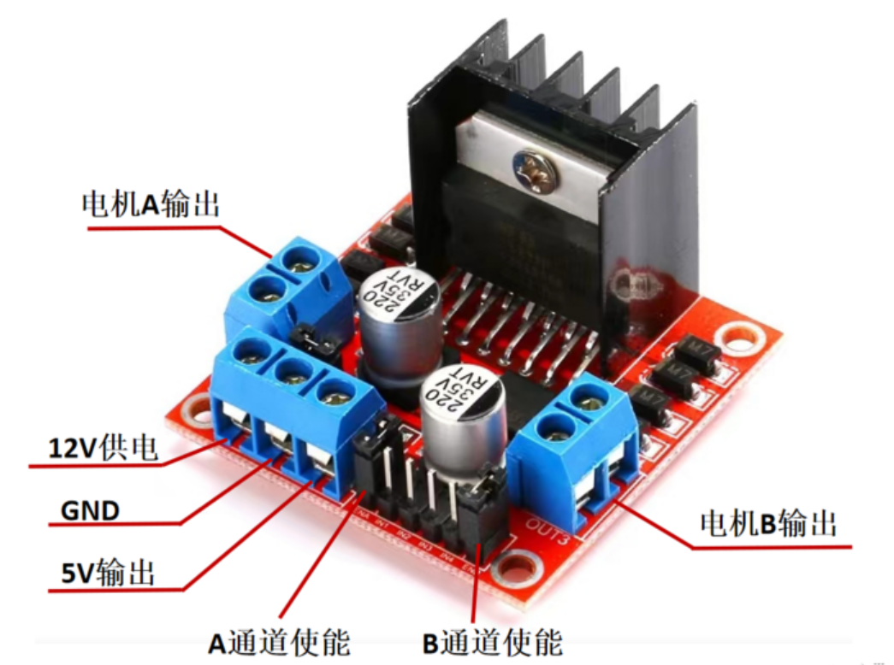

**说明：**

1. 12V输入端口接入供电电压， 5V端口为输出电压，电压过低会导致驱动电机动力不足，电压过高会烧坏芯片。

2. 当用跳线帽将ENA和ENB端口短接时，此时只需通过控制IN1、IN2、IN3、IN4上的电平，即可实现电机转动。ENA和ENB接入PWM信号可以对电机调速。

   

#### L298N电机状态控制表

| ENA  | IN1  | IN2  | ENB  | IN3  | IN4  | MotorA | MotorB |
| ---- | ---- | ---- | ---- | ---- | ---- | ------ | ------ |
| 1    | 1    | 0    | 1    | 1    | 0    | 正转   | 正转   |
| 1    | 0    | 1    | 1    | 0    | 1    | 反转   | 反转   |
| 1    | 1    | 1    | 1    | 1    | 1    | 停止   | 停止   |
| 1    | 0    | 0    | 1    | 0    | 0    | 停止   | 停止   |

ENA，ENB分别接入Arduino PWM引脚，通过调节PWM信号的占空比，可实现电机的调速，占空比越大，电机转速越快。同时由于硬件方面的原因，可能导致左右电机在相同占空比下，转速不同，这时需要调节PWM占空比实现智能小车的直线运行。

> 代码很简单，这里不再展示。
>
> 但是需要注意的是，GND接口为外界电源和Arduino共用。如果没有接Arduino的GND接口，电机不会转的。


## 附录

### C\C++语言基础

C\C++语言是国际上广泛流行的计算机高级语言。绝大多数硬件开发，均使用C/C++语言，Arduino也不例外。使用Arduino，需要有一定的C\C++基础，由于篇幅有限，本书仅对C\C++语言基础进行简单的介绍。此后章节中会穿插介绍一些特殊用法及编程技巧。

数据类型

在C\C++语言程序中，对所有的数据都必须指定其数据类型。数据又有常量和变量之分。

需要注意的是，Arduino Uno与AVR做核心的Arduino中的部分数据类型所占用的空间和取值范围有所不同。

#### 变量

在程序中数值可变的量称为变量。其定义方法如下

```c++
类型 变量名;
```

例如，定义一个整型变量i：

```c++
int i;
```

可以在定义时为其赋值，也可以定义后，对其赋值，例如：

```
int i;
i=95;
```

和

```
int i=95;
```

两者是等效的。

#### 常量

在程序运行过程中，其值不能改变的量，称为常量。常量可以是字符，也可以是数字，通常使用语句

```c++
const 类型 常量名 = 常量值
```

定义常量。

还可以用宏定义来达到相同的目的。语句如下：

```c++
#define 宏名 值
```

如在Arduino核心库中已定义的常数PI，即是使用

```c++
#define PI 3.1415926535897932384626433832795
```

定义的。

> **#define宏定义**
>
> 宏定义是C/C++语言提供的一种预处理方式，其允许使用标识符来表示一个字符串，编译器在开始编译前，会将代码中标识符全部替换成对应的字符串，以达到对程序预先处理的目的。合理使用宏定义，可以简化代码编写，避免输入及语法错误，提升编译运行效率，提高程序可读性。

#### 整型

整型即整数类型。Arduino Uno可使用的整型数据取值范围如下

| 类型          | 取值范围                                           | 说明         |
| ------------- | -------------------------------------------------- | ------------ |
| int           | –32,768 ~ 32,767 （ -215 ~ 215 - 1）               | 整型         |
| unsigned int  | 0 ~ 65,535 （ 0 ~ 216 - 1）                        | 无符号整型   |
| long          | –2,147,483,648 ~ 2,147,483,647 （ -231 ~ 231 - 1） | 长整型       |
| unsigned long | 0 ~ 4,294,967,295 （ 0 ~ 232 - 1）                 | 无符号长整型 |
| short         | –32,768 ~ 32,767 （ -215 ~ 215 - 1）               | 短整型       |

在Arduino Due、Zero中，int及unsigned int占用4字节（32位）。

#### 浮点型

浮点数也就是常说的实数。在Arduino中有 **float** 和 **double** 两种浮点类型，在Arduino Uno中，float类型占用4个字节（32位）内存空间，double类型也是占用4个字节（32位）内存空间；在Arduino Due、Zero中，float类型占用4个字节（32位）内存空间，而double类型占用8字节（64位）内存空间。

浮点型数据的运算速度较慢且有一定误差，因此，通常会把浮点型转换为整型再进行相关运算。如9.8cm，通常会换算为98mm再计算。

#### 字符型

字符型，即**char**类型，也是一种整型，占用一个字节内存空间，常用于存储字符变量。存储字符时，字符需要用单引号引用，如

```c++
char col='C';
```

字符都是以整数形式储存在char类型变量中的，数值与字符的对应关系，请参照附录中ASCII码表。

#### 布尔型

布尔型变量，即boolean。它的值只有两个：false（假）和true（真）。boolean会占用1个字节的内存空间。

#### 运算符

C\C++语言中有多种类型的运算符，常见运算符见表2-2：

| **运算符类型** | **运算符** | **说明**   |
| -------------- | ---------- | ---------- |
| 算术运算符     | =          | 赋值       |
|                | +          | 加         |
|                | -          | 减         |
|                | *          | 乘         |
|                | /          | 除         |
|                | %          | 取模       |
| 比较运算符     | ==         | 等于       |
|                | !=         | 不等于     |
|                | <          | 小于       |
|                | >          | 大于       |
|                | <=         | 小于或等于 |
|                | >=         | 大于或等于 |
| 逻辑运算符     | &&         | 逻辑与运算 |
|                | \|\|       | 逻辑或运算 |
|                | !          | 逻辑非运算 |
| 复合运算       | ++         | 自加       |
|                | --         | 自减       |
|                | +=         | 复合加     |
|                | -=         | 复合减     |

#### 表达式

通过运算符将运算对象连接起来的式子称之为表达式。如5+3、a-b、1<9等。

#### 数组

数组是由一组相同数据类型的数据构成的集合。数组概念的引入，使得在处理多个相同类型的数据时，程序更加清晰和简洁。

其定义方式如下：

```c++
数据类型 数组名称 [数组元素个数];
```

如，定义一个有5个int型元素的数组：

```c++
int a[5];
```

如果要访问一个数组中的某一元素，需要使用

```c++
数组名称[下标]
```

需要注意的是数组下标是从0开始编号的。如，将数组a中的第1个元素赋值为1：

```c++
a[0]=1;
```

可以使用以上方法对数组赋值，也可以在数组定义时，对数组进行赋值。如：

```c++
int a[5]={1,2,3,4,5};
```

和

```c++
int a[5]; 
a[0]=1; a[1]=2; a[2]=3; a[3]=4; a[4]=5;
```

是等效的。

#### 字符串

字符串的定义方式有两种，一种是以字符型数组方式定义，另一种是使用String类型定义。

```c++
char 字符串名称  [字符个数];
```

使用字符型数组的方式定义，使用方法和数组一致，有多少个字符便占用多少个字节的存储空间。

大多数情况下，可以使用String类型来定义字符串，该类型中提供一些操作字符串的成员函数，使得字符串使用起来更为灵活。

```c++
String 字符串名称; 
```

如

```c++
String abc;
```

即可定义一个名为abc的字符串。可以在定义时为其赋值，或在定义后为其赋值，如

```c++
String abc;
abc = "Arduino Uno";
```

和

```c++
String abc = "Arduino Uno";
```

是等效的。

相较于数组形式的定义方法，使用String类型定义字符串会占用更多的存储空间。

#### 注释

/*与*/之间的内容，及 // 之后的内容均为程序注释，使用它可以更好的管理代码。注释不会被编译到程序中，不影响程序的运行。
为程序添加注释的方法有两种：
单行注释：

```c++
// 注释内容
```

多行注释：

```c++
/*
注释内容1
注释内容2 
......
*/
```

#### 

