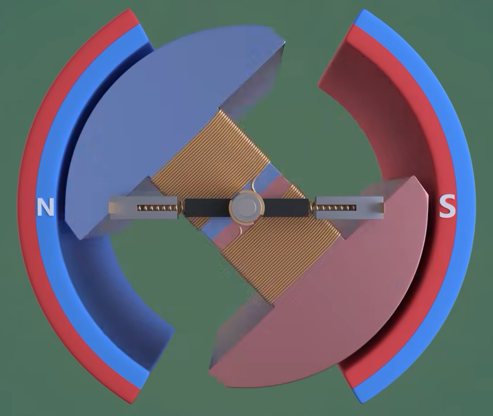
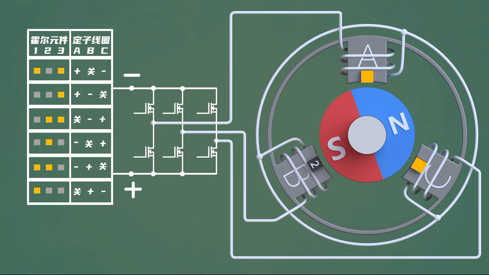
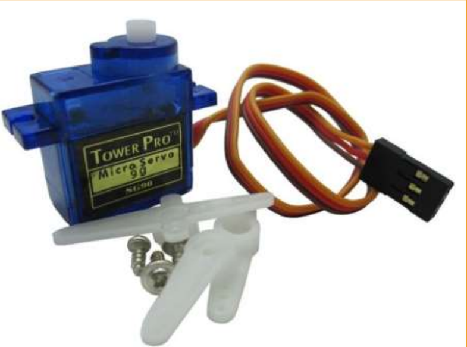
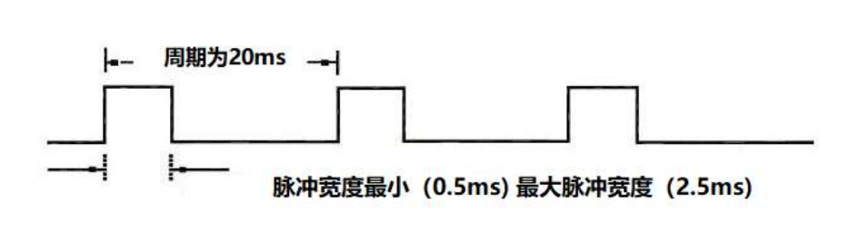
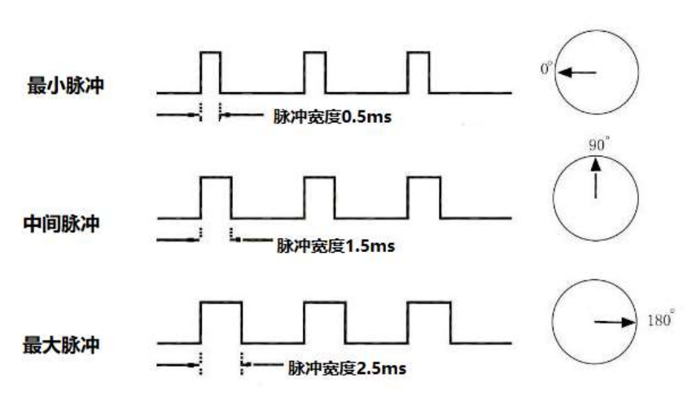

## 电动机介绍

### 有刷电机

有刷电机的工作原理基于电流通过碳刷与换向器的接触，产生磁场从而推动转子旋转（一般定子是线圈，转子是永磁体）。电流的方向变化通过换向器来实现，确保转子始终朝着一个方向转动。

优点是结构简单，价格便宜。缺点是碳刷会有磨损，有可能起火花等。

生活中一般简单地电动机都属于有刷电机。

### 无刷电机

无刷电机则利用电子控制器来管理电流，消除了碳刷和换向器（所以叫无刷电机）。永磁体与线圈交互（一般定子是永磁体，转子是线圈），电子控制器根据转子的位置信息精确调节电流的方向和强度，确保高效转动。无刷电机的控制系统可以实现更高的转速和精确的调节。

这种结构和控制方式使得无刷电机在效率、噪音和寿命上有显著优势，但相对成本较高。

#### KV值

电动机的KV值是‌无刷电机的一个重要性能参数，它代表电机的反电动势系数，即电机在旋转过程中产生的反向电动势与转子电流之间的比值。KV值通常用于衡量电机在空载条件下，每增加1伏特的电压，电机转速每分钟增加的转数。例如，一个标称为1000KV的电机，在11伏特的电压下，其最大空载转速为11000转/分钟。

KV值的计算方法

Kv值的计算公式为：Kv = qv * [ρ * △p0 / (ρ0 * △p)]^0.5，其中qv是‌气体流量，ρ是‌气体密度，△p是元件两端的压差。

#### KV值的应用场景

KV值在无刷电机中非常重要，因为它允许用户通过调整电压来预测和控制电机的转速。

例如，在‌遥控玩具、‌无人机等应用中，KV值常被用作规格标准来衡量电机的性能。此外，KV值与电机的‌输出功率和‌扭矩有关，低KV值的电机适合带动较大的‌螺旋桨，而高KV值的电机适合在电压较低时通过更多的电流来带动较小的螺旋桨。

### 舵机

在机器人机电控制系统中，舵机控制效果是性能的重要影响因素。舵机可以在微机电系统和航模中作为基本的输出执行机构，其简单的控制和输出使得单片机系统非常容易与之接口。

舵机是一种位置（角度）伺服的驱动器，适用于那些需要角度不断变化并可以保持的控制系统。目前在高档遥控玩具，如航模，包括飞机模型，潜艇模型；遥控机器人中已经使用得比较普遍。舵机是一种俗称，其实是一种伺服马达。可以旋转到 0 到 180 度之间的任何角度，然后根据您的指令精确停止，因此适用于需要角度变化和保持的控制系统。舵机是一个不专业的名称，实际上它是一种伺服电机，一套自动控制装置，由直流电机，减速齿轮组，传感器和控制电路组成。什么是自动控制？ 所谓的自动控制 - 通过使用闭环反馈控制电路不断调整输出偏差 - 使系统输出恒定。

1. **结构组成**：
   - 电动机：通常是直流电动机或无刷电动机，用于提供动力。
   - 齿轮系统：将电动机的旋转转换为舵机轴的特定角度。
   - 控制电路：接收输入信号并调节电动机的转动。
2. **信号输入**： 舵机通常接收来自控制器（如微控制器或遥控器）的脉宽调制（PWM）信号。信号的脉宽决定了舵机轴的目标角度。
3. **反馈机制**： 大多数舵机都内置位置传感器（如电位器），实时监测输出轴的位置，并将该信息反馈给控制电路。
4. **位置调节**： 控制电路根据输入信号与反馈信号的差异，调节电动机的转动，直到输出轴达到预定的角度。

#### 工作原理

舵机控制信号由接收机的通道进入信号调制芯片，获得直流偏置电压。它内部有一个基准电路，产生周期为 20ms，宽度为 1.5ms 的基准信号，将获得的直流偏置电压与电位器的电压比较，获得电压差输出。最后，电压差的正负输出到电机驱动芯片决定电机的正反转。当电机转速一定时，通过级联减速齿轮带动电位器旋转，使得电压差为 0，电机停止转动。舵机具有最大旋转角度，中间位置是指从该位置到最小角度的体积，并且最大角度完全相同。 最重要的部分，最大旋转角度随着不同的转向齿轮而变化，但中间位置的带宽是确定的，即 1.5 毫秒。舵机的控制一般需要一个 20ms 左右的时基脉冲，该脉冲的高电平部分一般为 0.5ms~2.5ms 范围内的角度控制脉冲部分。以 180 度角度伺服为例，那么对应的控制关系是这样的：

- 0.5ms--------------0 度；

- 1.0ms------------45 度；

- 1.5ms------------90 度；

-  2.0ms-----------135 度；

- 2.5ms-----------180 度；

旋转角度由来自控制线的连续脉冲产生。 该方法称为脉冲调制。 脉冲长度决定了转向器的旋转角度。 例如：舵机旋转到中间位置 1.5 毫秒脉冲（对于 180°舵机，中间位置为 90°）。 当控制系统发出命令将转向器移动到特定位置并使其保持一定角度时，外力的影响不会改变角度。 除非控制系统连续发出脉冲以稳定转向角，否则角度将不会始终保持不变。

当舵机接收到小于 1.5ms 的脉冲时，输出轴将作为标准中间位置，逆时针旋转一定角度; 当接收脉冲大于 1.5ms 时，输出轴顺时针旋转。 不同品牌的转向器，甚至同一品牌的不同转向器，最大值和最小值可能不同。

#### 应用实例

- 机器人关节：控制机器人的手臂和腿部的运动。
- 遥控飞机：调节舵面以改变飞行姿态。
- 模型赛车：控制方向和速度。

